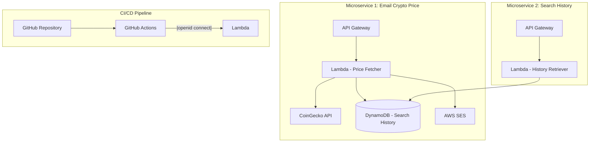

# Crypto Price system

Welcome to the Crypto Price system! You can query the current price of a specific cryptocurrency and receive the result from your email.
This Crypto Price system is built on [CoinGecko API](https://docs.coingecko.com/v3.0.1/reference/introduction), which is integrated with more than 1,000 crypto exchanges and lists more than 15,000 coins.

## Getting started

This microservice uses technologies that have stood the test of time.

- [TypeScript](https://www.typescriptlang.org/)
- [NodeJS](https://docs.nestjs.com/)

### Architecture diagram



### Local development commands

```bash
# Install dependencies
yarn install

# Setup AWS credentials
aws credentials

# Build a function that you need, e.g.
yarn build fetchCryptoCurrentPrice

# Create a lambda function that you need. Note: create the function after the build step.
yarn create-lambda fetchCryptoCurrentPrice

# Update a lambda function.
yarn build-and-deploy:fetchCryptoCurrentPrice
```

## API

Here is the Demo URL: https://zmo4wwe92d.execute-api.ap-southeast-2.amazonaws.com/dev/

- `GET /subscribe?email=:email`: Add email subscription. DEMO API is under development mode. Any new email needs to sign up in order to work with the rest of the endpoints.
  - Query parameters:
    - `:email`: Email that used to query crypto price.
- `GET /current-price?coin=:coinId&email=:email`: Get current price by coin ID.

  - Query parameters:
    - `:coinId`: Coin ID.
    - `:email`: Email that wants to receive the result.

- `GET /search-history?email=:email`: Retrieve all the search history by email.
  - Query parameters:
    - `:email`: Email that used to query crypto price.

### 👍 Tips
1. Gmail has a more strict policy on reciving SES email as Demo uses email identity instead of domain. Outlook works perfectly fine with Demo.

2. You may obtain the coin id via several ways:

- refers to respective coin page and find 'api id'
- refers to google sheets here [https://docs.google.com/spreadsheets/d/1wTTuxXt8n9q7C4NDXqQpI3wpKu1_5bGVmP9Xz0XGSyU/edit?usp=sharing]. Reference: [link from CoinGecko](https://docs.coingecko.com/v3.0.1/reference/simple-price)

Alternatively, you can use [postman_collection.json](https://github.com/biaoli0/CryptoPriceSystem#:~:text=33%20minutes%20ago-,postman_collection.json,-Add%20documentation) for the Demo API call.
